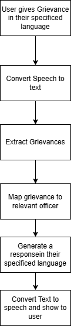

# Grievance-Filing-System

## Architecture

This diagram represents the architecture of the system:



## Future Enhancements

1) Automated Mapping and Categorisation to relevant Government Officers
2) Advanced Data Analysis and Documentation
3) Image and Document Processing
4) AI-Powered Resolution and Insights
5) Summarizer

## Setup Instructions

### Step 1: Install Dependencies
Ensure you have all required dependencies installed. Run the following command to install packages from `requirements.txt`:

```bash
pip install -r requirements.txt
```

### Step 2: Launch the Streamlit App

```bash
streamlit run main.py
```

## Running using Just

Just is a command runner which helps run in running containers

### Starting bot

```bash
just start-bot
```

### Stopping bot

```bash
just stop-bot
```

### Follow logs

```bash
just follow-logs bot
```

## Example Video

[Watch the video](video.mp4)


## Deployed Application

You can access the live application by clicking on the link below:

[Grievance Filing System](https://grievance-filing-system-qf453djhqosw45zmyzn7lr.streamlit.app/)
